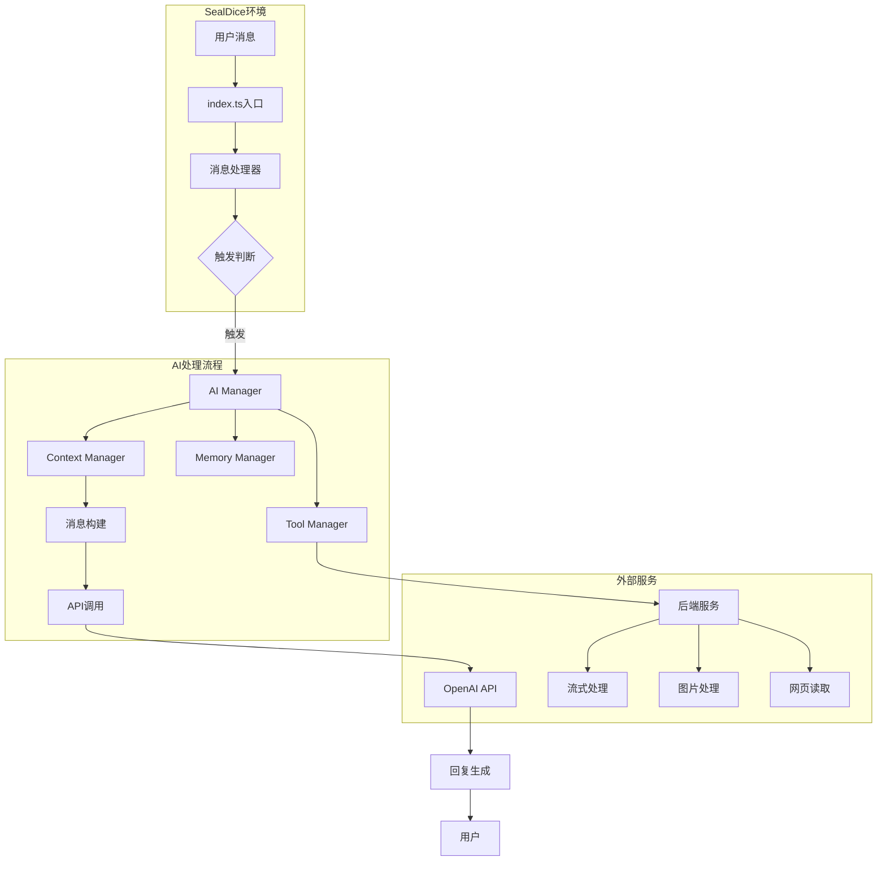

# AI骰娘4 技术文档

## 目录
- [项目概述](#项目概述)
- [系统架构](#系统架构)
- [核心模块详解](#核心模块详解)
- [配置系统](#配置系统)
- [工具函数系统](#工具函数系统)
- [后端服务](#后端服务)
- [API接口说明](#api接口说明)
- [开发指南](#开发指南)

## 项目概述

AI骰娘4是一个基于TypeScript开发的SealDice AI插件，通过接入OpenAI兼容API实现智能对话功能。该插件深度整合了海豹骰子的核心功能，为TRPG玩家提供智能化的游戏体验。

### 技术栈

- **主语言**: TypeScript
- **运行环境**: SealDice JavaScript插件环境
- **构建工具**: esbuild
- **模板引擎**: Handlebars
- **工具库**: lodash-es
- **后端服务**: Python (FastAPI/Flask) + Node.js (Express/Puppeteer)

### 项目结构

```
aiplugin4/
├── src/                      # 源代码目录
│   ├── index.ts             # 插件入口文件
│   ├── AI/                  # AI核心模块
│   │   ├── AI.ts           # AI管理器和主逻辑
│   │   ├── context.ts      # 上下文管理
│   │   ├── memory.ts       # 记忆系统
│   │   ├── image.ts        # 图片处理
│   │   ├── service.ts      # API服务调用
│   │   ├── logger.ts       # 日志系统
│   │   └── update.ts       # 更新管理
│   ├── config/              # 配置模块
│   │   ├── config.ts       # 配置管理器
│   │   └── config_*.ts     # 各类配置项
│   ├── tool/                # 工具函数模块
│   │   ├── tool.ts         # 工具管理器
│   │   └── tool_*.ts       # 各类工具实现
│   └── utils/               # 工具函数
│       └── utils_*.ts       # 各类工具函数
├── 相关后端项目/            # 后端服务
│   ├── 流式输出/           # 流式API处理
│   ├── 图片url转base64/    # 图片转换服务
│   ├── 用量图表绘制/       # Token使用统计
│   └── 网页url内容读取/    # 网页爬虫服务
└── build/                   # 构建输出目录
```

## 系统架构

### 整体架构图



### 核心流程

1. **消息接收**: 通过`ext.onNotCommandReceived`和`ext.onCommandReceived`接收消息
2. **触发判断**: 根据配置的触发条件判断是否需要AI回复
3. **上下文构建**: 整合系统消息、示例对话、历史对话等
4. **API调用**: 发送请求到配置的大模型API
5. **工具调用**: 根据需要调用各种工具函数
6. **回复处理**: 处理AI回复并发送给用户

## 核心模块详解

### AI模块 (`src/AI/`)

#### AI.ts - AI核心管理

```typescript
export class AI {
    id: string;                    // AI实例ID
    version: string;               // 版本号
    context: Context;              // 上下文管理器
    tool: ToolManager;            // 工具管理器
    memory: Memory;               // 记忆管理器
    imageManager: ImageManager;   // 图片管理器
    privilege: Privilege;         // 权限设置
    stream: {...}                 // 流式处理状态
    bucket: {...}                 // 触发次数限制
    
    async chat(ctx: seal.MsgContext, msg: seal.Message): Promise<void> {
        // 核心对话处理逻辑
        // 1. 检查触发次数限制
        // 2. 构建消息
        // 3. 发送API请求
        // 4. 处理回复
        // 5. 保存上下文
    }
    
    async chatStream(...): Promise<void> {
        // 流式对话处理
        // 支持实时输出和工具调用
    }
}

export class AIManager {
    static cache: { [key: string]: AI } = {};
    static usageMap: {...}  // Token使用统计
    
    static getAI(id: string): AI {
        // 获取或创建AI实例
        // 支持持久化存储
    }
}
```

#### Context.ts - 上下文管理

```typescript
export interface Message {
    role: string;              // 角色: system/user/assistant/tool
    tool_calls?: ToolCall[];   // 工具调用
    tool_call_id?: string;     // 工具调用ID
    uid: string;               // 用户ID
    name: string;              // 用户名
    contentArray: string[];    // 内容数组
    msgIdArray: string[];      // 消息ID数组
    images: Image[];           // 图片数组
}

export class Context {
    messages: Message[];       // 消息历史
    ignoreList: string[];     // 忽略名单
    summaryCounter: number;   // 总结计数器
    
    async addMessage(...): Promise<void> {
        // 添加消息到上下文
        // 支持消息合并和限制
    }
    
    async findUserId(ctx, name): Promise<string> {
        // 智能查找用户ID
        // 支持模糊匹配
    }
}
```

#### Memory.ts - 记忆系统

```typescript
export interface MemoryInfo {
    id: string;                // 记忆ID
    isPrivate: boolean;        // 是否私人记忆
    player: {...}              // 玩家信息
    group: {...}               // 群组信息
    time: string;              // 记忆时间
    createTime: number;        // 创建时间戳
    lastMentionTime: number;   // 最后提及时间
    keywords: string[];        // 关键词
    content: string;           // 记忆内容
    weight: number;            // 权重(0-10)
}

export class Memory {
    persona: string;                              // 角色设定
    memoryMap: { [key: string]: MemoryInfo };   // 长期记忆
    shortMemory: string[];                       // 短期记忆
    
    addMemory(ctx, keywords, content): void {
        // 添加记忆
        // 自动管理记忆数量
    }
    
    updateMemoryWeight(s: string, role: string): void {
        // 更新记忆权重
        // 根据提及频率自动调整
    }
}
```

#### Service.ts - API服务

```typescript
export async function sendChatRequest(
    ctx, msg, ai, messages, tool_choice
): Promise<string> {
    // 发送聊天请求
    // 支持函数调用
    // 自动重试机制
}

export async function startStream(messages): Promise<string> {
    // 启动流式对话
    // 返回会话ID
}

export async function pollStream(id, after): Promise<{...}> {
    // 轮询流式内容
    // 增量返回结果
}
```

### 配置模块 (`src/config/`)

#### 配置管理器

```typescript
export class ConfigManager {
    static ext: seal.ExtInfo;
    static cache: {...}  // 配置缓存
    
    // 配置获取器
    static get log() { return this.getCache('log', LogConfig.get) }
    static get request() { return this.getCache('request', RequestConfig.get) }
    static get message() { return this.getCache('message', MessageConfig.get) }
    static get tool() { return this.getCache('tool', ToolConfig.get) }
    // ...更多配置
}
```

#### 主要配置项

| 配置类 | 功能 | 主要配置项 |
|--------|------|------------|
| RequestConfig | API请求 | URL、API Key、请求体模板 |
| MessageConfig | 消息处理 | 角色设定、示例对话、上下文限制 |
| ToolConfig | 工具函数 | 开关、连续调用次数、禁用列表 |
| ReceivedConfig | 触发设置 | 触发正则、忽略正则、触发次数限制 |
| ReplyConfig | 回复处理 | 最大字数、防复读、过滤正则 |
| ImageConfig | 图片处理 | 本地路径、识别API、偷图设置 |
| MemoryConfig | 记忆设置 | 记忆上限、短期记忆、总结模板 |
| BackendConfig | 后端服务 | 各服务URL配置 |

### 工具函数系统 (`src/tool/`)

#### 工具管理器

```typescript
export class ToolManager {
    static toolMap: { [key: string]: Tool } = {};
    toolStatus: { [key: string]: boolean };
    toolCallCount: number;
    
    getToolsInfo(type: string): ToolInfo[] {
        // 获取可用工具列表
        // 根据场景过滤
    }
    
    static async handleToolCalls(
        ctx, msg, ai, tool_calls
    ): Promise<string> {
        // 处理工具调用
        // 支持连续调用
        // 返回tool_choice
    }
}
```

#### 工具函数分类

##### 记忆管理类
- `add_memory` - 添加记忆
- `del_memory` - 删除记忆
- `show_memory` - 查看记忆

```typescript
// 工具定义示例
const info: ToolInfo = {
    type: 'function',
    function: {
        name: 'add_memory',
        description: '添加个人记忆或群聊记忆',
        parameters: {
            type: 'object',
            properties: {
                memory_type: {
                    type: "string",
                    enum: ["private", "group"]
                },
                name: { type: 'string' },
                keywords: { type: 'array' },
                content: { type: 'string' }
            },
            required: ['memory_type', 'name', 'keywords', 'content']
        }
    }
}
```

##### 游戏功能类
- `draw_deck` - 抽取牌堆
- `jrrp` - 今日人品
- `roll_check` - 属性检定
- `san_check` - SAN值检定
- `modu_roll` - 随机模组
- `attr_show/get/set` - 属性管理

##### 群管理类
- `ban/whole_ban` - 禁言管理
- `rename` - 修改群名片
- `group_sign` - 群打卡
- `get_person_info` - 获取用户信息

##### 消息处理类
- `send_msg` - 发送消息
- `get_msg` - 获取消息
- `delete_msg` - 撤回消息
- `set_essence_msg` - 设置精华

##### 图片处理类
- `image_to_text` - 图片识别
- `check_avatar` - 查看头像
- `text_to_image` - 生成图片
- `save_image` - 保存表情包

##### 其他功能类
- `get_time` - 获取时间
- `set_timer` - 设置定时器
- `web_search` - 网页搜索
- `web_read` - 网页阅读
- `music_play` - 音乐播放

## 后端服务

### 流式输出服务 (Python/FastAPI)

```python
# stream_backend.py
# 端口: 3010
# 功能: 处理流式API响应，智能分割文本

@app.post("/start")
async def start_completion(request: Request):
    # 启动流式处理
    # 返回会话ID
    
@app.get("/poll")
async def poll_completion(id: str, after: int):
    # 轮询获取结果
    # 增量返回
    
@app.get("/end")
async def end_completion(id: str):
    # 结束会话
    # 返回token统计
```

**智能分割算法**:
- 识别成对符号（括号、引号等）
- 在标点符号处分割
- 强制分割过长文本（150字符）

### 图片转Base64服务 (Python/Flask)

```python
# urltobase64.py
# 端口: 46678
# 功能: 将图片URL转换为Base64

@app.route('/image-to-base64', methods=['POST'])
def image_to_base64():
    # 下载图片
    # 检测格式
    # 转换为Base64
    # 静态GIF转PNG
```

### 使用统计图表服务 (Python/FastAPI)

```python
# usage_chart.py
# 端口: 3009
# 功能: 生成Token使用统计图表

@app.post("/chart")
async def get_chart_url(request: Request):
    # 接收统计数据
    # 生成图表
    # 返回临时URL
```

### 网页读取服务 (Node.js/Puppeteer)

```javascript
// puppeteer.js
// 端口: 46799
// 功能: 读取网页内容

app.post('/scrape', async (req, res) => {
    // 使用Puppeteer加载页面
    // 等待渲染完成
    // 提取文本内容
});
```

## API接口说明

### 主要命令接口

#### AI控制命令

| 命令 | 功能 | 权限要求 |
|------|------|----------|
| `.ai st <ID> <权限>` | 设置权限 | 骰主 |
| `.ai on --c=10 --t=60` | 开启AI | 配置权限 |
| `.ai off` | 关闭AI | 配置权限 |
| `.ai fgt` | 清除上下文 | 配置权限 |
| `.ai role <序号>` | 切换角色 | 配置权限 |

#### 记忆管理命令

| 命令 | 功能 |
|------|------|
| `.ai memo p st <内容>` | 设置个人设定 |
| `.ai memo p show` | 查看个人记忆 |
| `.ai memo p del <ID>` | 删除记忆 |
| `.ai memo g clr` | 清除群聊记忆 |

#### 工具管理命令

| 命令 | 功能 |
|------|------|
| `.ai tool` | 列出工具 |
| `.ai tool help <name>` | 查看工具详情 |
| `.ai tool <name> on/off` | 开关工具 |

### 内部消息格式

#### 用户消息格式
```
<|from:用户名(QQ号)|>消息内容
<|msg_id:xxx|>带消息ID的内容
<|img:xxxxxx:描述|>图片内容
<|@某人|>艾特某人
```

#### AI回复格式
```
普通文本
\f分割多条消息
[CQ:at,qq=123456]艾特
[CQ:image,file=url]图片
<function>{"name":"函数名","arguments":{...}}</function>
```

## 开发指南

### 环境搭建

1. **安装依赖**
```bash
npm install
```

2. **配置TypeScript**
```json
// tsconfig.json关键配置
{
  "compilerOptions": {
    "target": "es2017",
    "module": "commonjs",
    "lib": ["es2017", "DOM"],
    "typeRoots": ["./types"]
  }
}
```

3. **构建项目**
```bash
npm run build      # 生产构建
npm run build-dev  # 开发构建
```

### 添加新工具函数

1. **创建工具文件** `src/tool/tool_example.ts`

```typescript
import { Tool, ToolInfo, ToolManager } from "./tool";

export function registerExample() {
    const info: ToolInfo = {
        type: "function",
        function: {
            name: "example_tool",
            description: "示例工具",
            parameters: {
                type: "object",
                properties: {
                    param1: {
                        type: "string",
                        description: "参数1"
                    }
                },
                required: ["param1"]
            }
        }
    };
    
    const tool = new Tool(info);
    tool.solve = async (ctx, msg, ai, args) => {
        const { param1 } = args;
        // 实现逻辑
        return `处理结果`;
    };
    
    ToolManager.toolMap[info.function.name] = tool;
}
```

2. **注册工具** 在 `src/tool/tool.ts` 中

```typescript
static registerTool() {
    // ...existing tools
    registerExample();
}
```

### 添加新配置项

1. **创建配置类** `src/config/config_example.ts`

```typescript
import { ConfigManager } from "./config";

export class ExampleConfig {
    static ext: seal.ExtInfo;
    
    static register() {
        ExampleConfig.ext = ConfigManager.getExt('aiplugin4_example');
        seal.ext.registerStringConfig(
            ExampleConfig.ext, 
            "配置项名称", 
            "默认值", 
            "说明"
        );
    }
    
    static get() {
        return {
            configValue: seal.ext.getStringConfig(
                ExampleConfig.ext, 
                "配置项名称"
            )
        };
    }
}
```

2. **注册配置** 在 `src/config/config.ts` 中

```typescript
static registerConfig() {
    // ...existing configs
    ExampleConfig.register();
}

static get example() { 
    return this.getCache('example', ExampleConfig.get) 
}
```

### 性能优化建议

1. **配置缓存**: 使用3秒缓存避免频繁读取
2. **消息限制**: 合理设置上下文轮数限制
3. **记忆管理**: 自动清理过期记忆
4. **流式处理**: 大文本使用流式输出
5. **异步处理**: 工具调用使用异步
6. **错误处理**: 完善的try-catch和日志

### 调试技巧

1. **日志级别**
```typescript
logger.info("信息日志");
logger.warning("警告日志");
logger.error("错误日志", error);
```

2. **消息追踪**
- 使用消息ID追踪对话流程
- 在关键节点记录日志

3. **性能监控**
- 记录API响应时间
- 统计Token使用量
- 监控内存使用

## 版本管理

### 版本号规则
- 主版本号: 重大更新
- 次版本号: 功能更新
- 修订号: Bug修复

### 更新机制
```typescript
export function checkUpdate() {
    const oldVersion = ConfigManager.ext.storageGet("version");
    if (compareVersions(oldVersion, VERSION) < 0) {
        // 执行更新逻辑
        // 显示更新日志
    }
}
```

## 最佳实践

### 权限管理
- 使用分级权限系统
- 骰主 > 群主 > 管理员 > 普通用户
- 敏感操作需要高权限

### 错误处理
- 所有异步操作使用try-catch
- 提供友好的错误提示
- 记录详细的错误日志

### 数据持久化
- 使用seal.ext.storageGet/Set
- 定期保存重要数据
- 实现数据迁移机制

### 安全考虑
- API Key加密存储
- 输入验证和清理
- 防止注入攻击
- 限制请求频率

## 总结

AI骰娘4是一个功能完善、架构清晰的AI对话插件。通过模块化设计和丰富的工具函数，为用户提供了强大而灵活的AI交互体验。项目采用TypeScript开发，具有良好的类型安全性和可维护性。配合多个后端服务，实现了流式输出、图片处理、网页读取等高级功能。

开发者可以通过本文档快速了解项目结构，并根据需要进行二次开发和功能扩展。